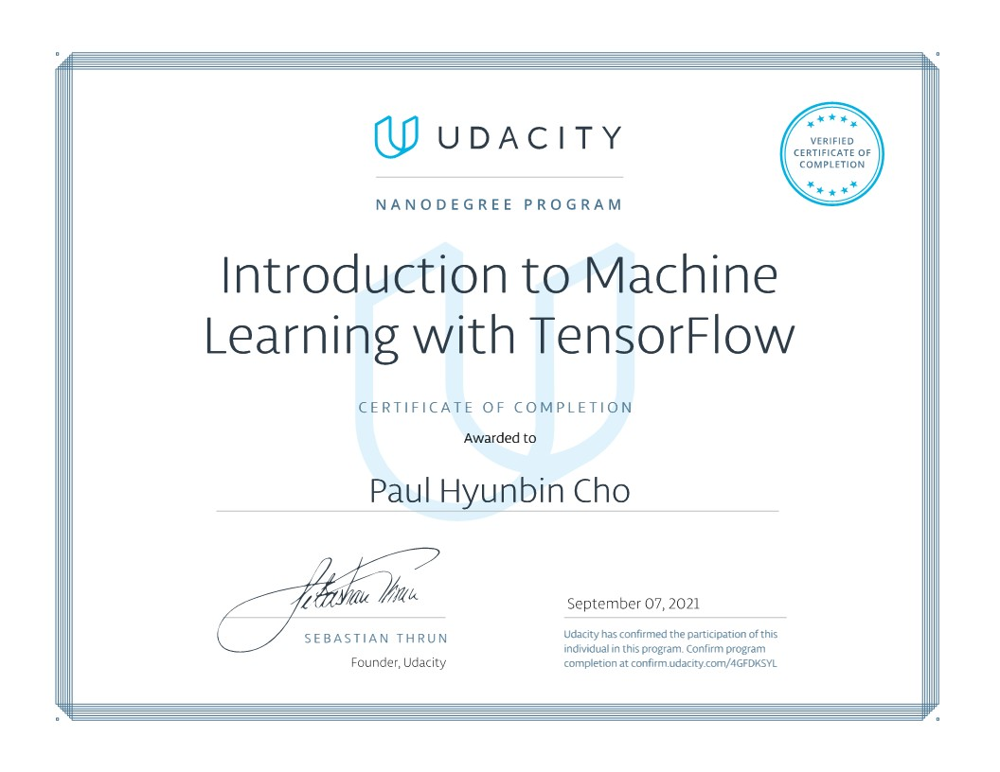

# Udacity Introduction to Machine Learning with Tensorflow

## Skills Learned:
### Course 1: Supervised Learning
1. Regressiong
2. Perceptron Algorithms
3. Decision Trees
4. Naive Bayes
5. Support Vector Machines
6. Ensemble of Learners
7. Evaluation Metrics
8. Training and Tuning Models

### Course 2: Neural Networks
1. Introduction to Neural Networks
2. Implementing Gradient Descent
3. Training Neural Networks
4. Deep Learning with Tensorflow

### Course 3: Unsupervised Learning
1. Clustering
2. Hierarchical and Density-Based Clustering
3. Gaussian Mixture
4. Dimensionality Reduction

## Projects:
### 1. Finding Donors for CharityML
CharityML is a fictitious charity organization located in the heart of Silicon Valley that was established to provide financial support for people eager to learn machine learning. After nearly 32,000 letters were sent to people in the community, CharityML determined that every donation they received came from someone that was making more than $50,000 annually. To expand their potential donor base, CharityML has decided to send letters to residents of California, but to only those most likely to donate to the charity. With nearly 15 million working Californians, CharityML has brought you on board to help build an algorithm to best identify potential donors and reduce overhead cost of sending mail. Your goal will be evaluate and optimize several different supervised learners to determine which algorithm will provide the highest donation yield while also reducing the total number of letters being sent.
### 2. Create Your Own Image Classifier
In this project, you'll train an image classifier to recognize different species of flowers. You can imagine using something like this in a phone app that tells you the name of the flower your camera is looking at. In practice you'd train this classifier, then export it for use in your application. We'll be using this dataset from Oxford of 102 flower categories.
### 3. Identify Customer Segments with Arvato
Use unsupervised learning techniques to see if any similarities exist between customers and use those similarities to segment customers into distinct categories using various clustering techniques. This segmentation is used to help the business make more informed marketing and product decisions.
